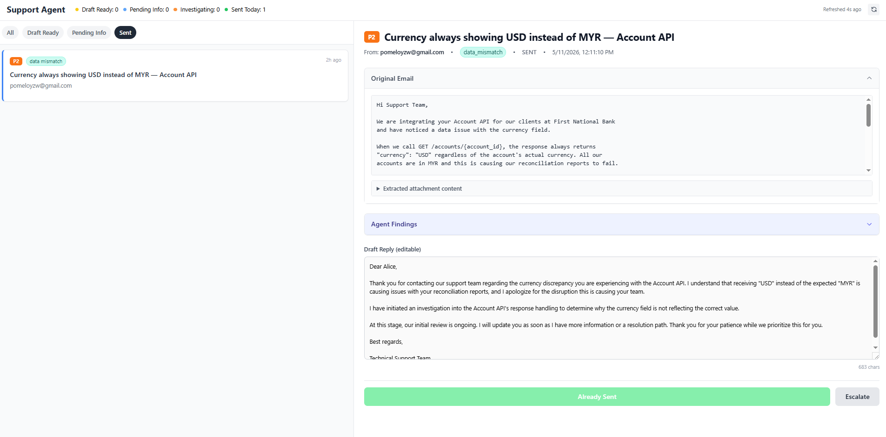
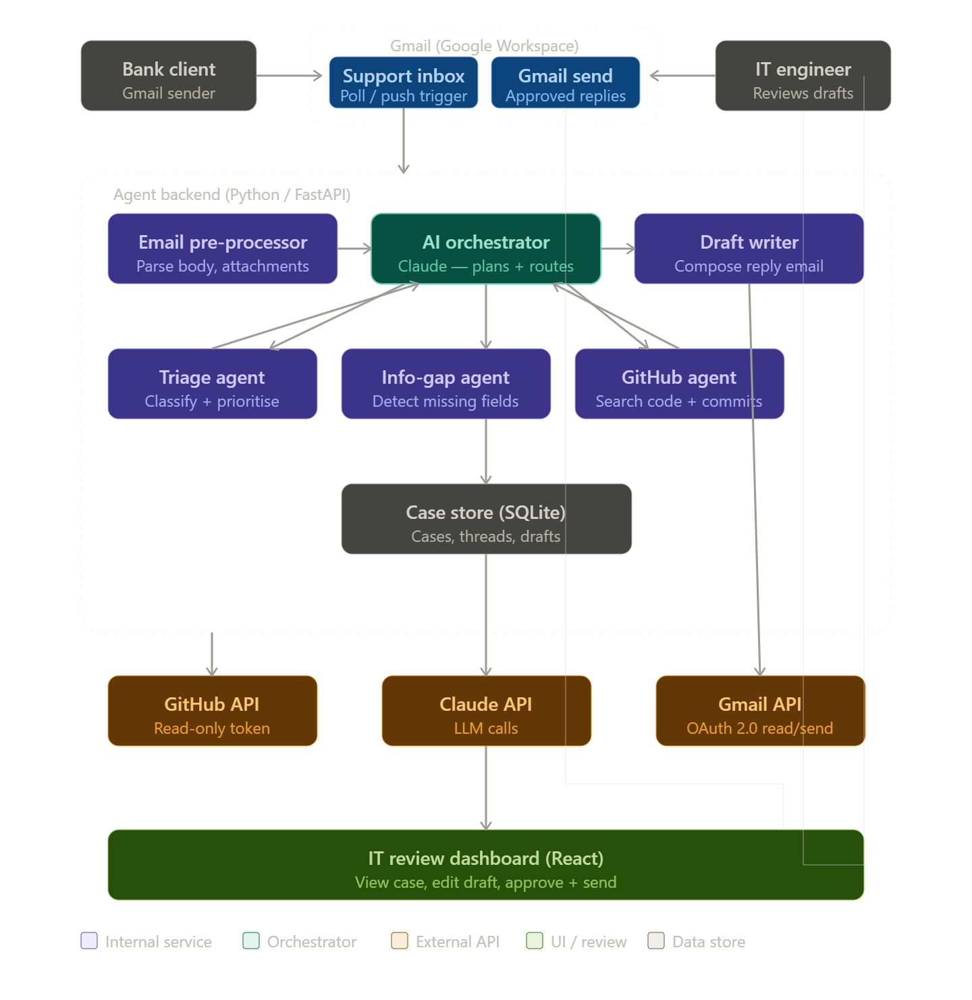
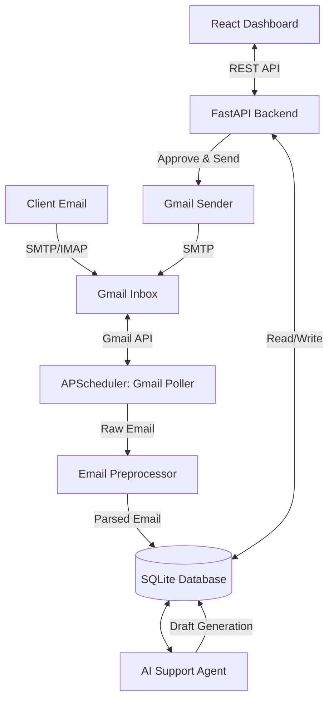

# AI Technical Support Agent

AI Technical Support Agent is an automated, intelligent B2B SaaS support system that integrates directly with Gmail. It uses AI to read incoming support emails, triage them, gather information, and draft replies for IT engineers to review and send.

## 📸 System Frontend



## 🏗️ System Architecture





## 💻 Technical Stack

**Backend:**
- **Language**: Python 3.11+
- **Framework**: FastAPI
- **Database**: SQLite (via `aiosqlite`)
- **Task Scheduling**: APScheduler (for background Gmail polling)
- **External APIs**: Gmail API (OAuth 2.0 Desktop Client credentials)
- **AI Integration**: Agent orchestrator utilizing LLMs for triage and response generation.

**Frontend:**
- **UI Framework**: React 18 
- **Styling**: Tailwind CSS
- **Build**: Standalone Babel for in-browser JSX compilation

## 🚀 How to Run

### Prerequisites
1. Python 3.11+ installed.
2. Tesseract OCR installed and added to PATH (used for processing image attachments).
3. A Google Cloud project with the **Gmail API** enabled. Download the OAuth 2.0 Desktop Client credentials as `credentials.json` and place it in the root directory.

### Setup Instructions

```bash
# 1. Create and activate a virtual environment
python -m venv .venv
source .venv/bin/activate          # On Windows: .venv\Scripts\activate

# 2. Install dependencies
pip install -r requirements.txt

# 3. Start the application
uvicorn main:app --reload
```

### Accessing the Dashboard
Once the server is running, navigate to [http://localhost:8000/](http://localhost:8000/) in your browser. This will automatically redirect you to the React Dashboard where you can review, edit, and approve AI-generated email drafts.

> **Note**: On the first start, a browser window will open asking you to authorize Gmail access. After authorizing, the token is saved to `token.json` and all future starts will happen automatically.

## 🛠️ Key API Endpoints

- `GET /health` - Health check for the database and background scheduler
- `GET /api/cases` - Get a paginated list of support cases
- `GET /api/cases/{case_id}` - Detailed view of a single case including its draft and agent logs
- `PATCH /api/cases/{case_id}/draft` - Update an AI-generated draft
- `POST /api/cases/{case_id}/approve` - Approve a draft and send the reply via Gmail
- `POST /api/cases/{case_id}/escalate` - Escalate a case for manual intervention
